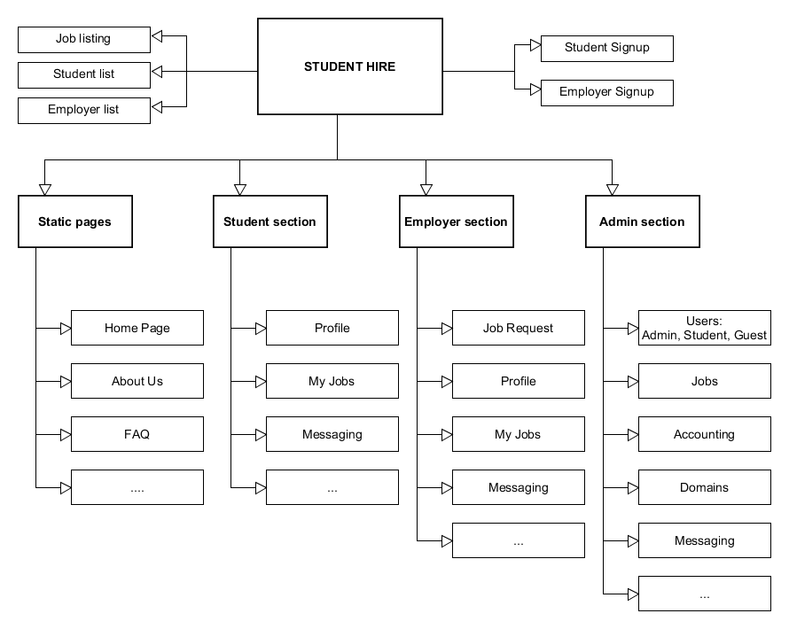
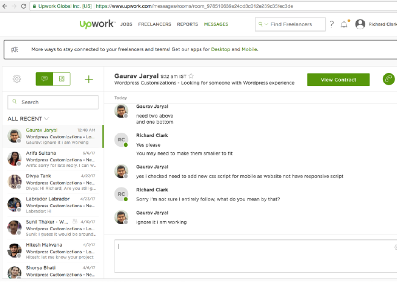

# Student Hire

## Website Outline

### Static Pages:

### Home Page
- Landing page somewhat similar to what it is now, except with a video background showing
short snippets of a few different tasks being completed by students. Media bar visible along
bottom and tool bar on the top.
- Keep mission statement underneath this.
- How it works section.
- how it works video
- how it works step by step click through the site process
- A section for insurance and talking about the protection for homeowners and students.
- A bar that keeps track of the running total that StudentHire has made for students. “Students
have completed _____ jobs and have made $______ on StudentHire”
- Keep the icons that explain the different tasks that we offer. When you click on one of the
icons it should take you to the job request form that is specific to that job.
- Then we should have a carousel of a few of our top students that you can scroll through and
get a glimpse of what the site is like in terms of its students. This should just be a short little
review of the students profile (Picture, school, program, rating out of five stars, start of one
review etc…)
- This should be followed by a testimonial section (The testimonials need to be awesome,
complete with a picture and where the review was taken from.)
- The bottom bar should contain the logo, contact us, terms and conditions, address, phone
number, email and all of our social media logos that are linked to our pages.
### About us Page
-We would want an about us page that tells a little bit about our story and our team. (Again we
would provide the content on this.
### FAQ
-We would need a frequently asked questions page (we would provide the content).

## Students
### My Jobs
-You should have a jobs page where you can view all of the current jobs that you have open as
well as the jobs that you have applied for. The jobs that you have applied for would be taken
away once the job has been assigned.
-On the job form the student should be able to click the complete button which would send a
notification to the homeowner to also complete the job. Once the complete button has been
clicked on both sides the funds are then transferred.
- Also if there is an hourly job then there needs to be a place where the student can enter in
how many hours that they worked and then submit that. (TaskRabbit has a feature where you
can enter in hours worked).
-Once submitted the employer would then have the opportunity to review hours worked and
confirm or dispute.
When you are selected for a job
-When you are selected for a job, set up a feature that sends a text to the students phone that
says “You have been successfully hired for ___________ job. The employers name is
__________ and their contact information is ___________. Please contact them immediately to
go and complete the job. Thanks.”
Improve your profile
-There should maybe be a place that you can post about improving your profile. Which then
lists ways that you can improve your profile and land more jobs.
- LinkedIn style profile improvement
Payment
-There needs to be a payment section where you must sign into your paypal account in order to
properly link it to your account so that you can get paid.
-Need to verify the paypal account before you can apply for a job
-We should also explore other payment options, such as how askfortask or upwork pays their
clients.
-store credit card information from customers in the site once they sign up
- take credit card information as early as possible and only take it once, charge them once the
work is done
-maybe have a system where all the money a student earns is stored in their account until they
are ready to cash out, they can click “cash out” and that will send their money to a paypal
account
Student Resources
-This should be a place where students can go and view all of the different resources available
to them. Student discounts, great sites for students to get help on canva, studentuniverse etc..
basically it can be a blog submitted by the students to help each other out in finding awesome
resources.

### Messaging Page (For Students)
-The messaging page for the students should be almost identical to the messaging page of
upwork. (See picture below)

-Also if you are invited to a job by a client you should be able to message the homeowner back.
-It needs to have an instant chat like feel where you can message back and forth quite quickly.
-This should be listed as “Messages” on the top bar after you have signed in as a student.
-There should be obvious buttons on the messaging platform where it says “Hire this Student”
then you can click that and assign which job you would ike to hire them for if you have multiple
jobs open. - hire students straight out of the messaging conversation
- Also you should be able to send back and forth custom proposals between the employer and
the student. Again very similar to upwork in this regard. (See example screen shot below).
-Text message to student when they are accepted for a job - all of employers contact info so
they can call or text them right away.

test

