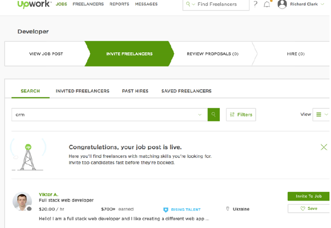

# Student Hire

## Website Roles

## Website Outline

### Static Pages:

### Home Page

- Landing page somewhat similar to what it is now, except with a video background showing
short snippets of a few different tasks being completed by students. Media bar visible along
bottom and tool bar on the top.
- Keep mission statement underneath this.
- How it works section.
- how it works video
- how it works step by step click through the site process
- A section for insurance and talking about the protection for homeowners and students.
- A bar that keeps track of the running total that StudentHire has made for students. “Students
have completed _____ jobs and have made $______ on StudentHire”
- Keep the icons that explain the different tasks that we offer. When you click on one of the
icons it should take you to the job request form that is specific to that job.
- Then we should have a carousel of a few of our top students that you can scroll through and
get a glimpse of what the site is like in terms of its students. This should just be a short little
review of the students profile (Picture, school, program, rating out of five stars, start of one
review etc…)
- This should be followed by a testimonial section (The testimonials need to be awesome,
complete with a picture and where the review was taken from.)
- The bottom bar should contain the logo, contact us, terms and conditions, address, phone
number, email and all of our social media logos that are linked to our pages.

### About us Page

-We would want an about us page that tells a little bit about our story and our team. (Again we
would provide the content on this.

### FAQ

-We would need a frequently asked questions page (we would provide the content).

## Sign Up form

### Students

-Step by Step sign up form, very similar to the one that Upwork has for their freelancers.

-Put all the easy information in the front of the form and then the more difficult stuff in the
back.
-Verification email sent to your school email address. Verify to complete sign up.
-Name, School attending, program.
-Provide an overview box where they can type a few things about themselves.
-Work experience section.
-Relatable classes that they’ve taken
-Portfolio for Photography and graphic design students. (If they can post folders to this that
would be great).
-Also any skills or certifications they have.
-Student ID verification
-LinkdIn type profile creation - show how good your profile is as a percentage, show what you
can do to improve it
-Or, start profile creation with easy stuff and slowly get to more complicated stuff so they get
more invested as they go.

### Employers

-I really like the way that AskforTask handles its sign ups. If we could almost integrate this with
the job request form that would be great.
-Also as a type of vetting process, employers posting in home jobs would need to link their accounts to their social media accounts and phone number in order to post a job.

**Job Request form**

-This form is the start of the person’s experience on the site and needs to be simple and well
laid out. There needs to be a bar underneath the main bar highlighting which stage of
progression the person is at on the site. Post a Job → Go through Applicants → Hire a Student
etc… Similar to Upwork again (See screenshot below)

-This form needs to be nearly identical to the AskForTask job request form and would give
conditional questions based on which task was chosen.

-Also when the icons on the homepage are clicked it should take you to a job request form
specific to the icon that was clicked.
-It could also include a few aspects of the UpWork form as well, which deals with adding more
than one student to the job. So posting a job looking for multiple students.
- You should be able to choose between setting an hourly rate or setting a fixed price for the
job.
- I think if the homeowner doesn’t know what to pay on the job, this could be solved one of two
ways. 1. Insert pricing suggestion feature to suggest price based on previous jobs done on the
site that were similar. 2. Allow students to bid for selected job.
-Recurring job feature - set the job as a weekly or monthly job, invoice sent monthly and card
charged automatically unless cancelled.
-Once the job has been requested it should take the homeowner to the next stage which is
getting applicants for your job. This should bring up a list of suggested students that have
entered in that job category on their profile (this should be somewhat random at first so that
the same students don’t end up getting picked every time, eventually it could be based on
reviews). Exactly like Upwork where you can then invite the students to apply for your job.
-Will have to be based on ratings and reviews eventually, when we start it will have to
be random so the same students dont keep getting hired.
Messaging
- The next step would be the messaging stage where it would take you to the inviting of
students and then receiving of proposals and then messaging those students.
- The messaging would be exact same as student’s side of things.

## Students

### My Jobs
-You should have a jobs page where you can view all of the current jobs that you have open as
well as the jobs that you have applied for. The jobs that you have applied for would be taken
away once the job has been assigned.
-On the job form the student should be able to click the complete button which would send a
notification to the homeowner to also complete the job. Once the complete button has been
clicked on both sides the funds are then transferred.
- Also if there is an hourly job then there needs to be a place where the student can enter in
how many hours that they worked and then submit that. (TaskRabbit has a feature where you
can enter in hours worked).
-Once submitted the employer would then have the opportunity to review hours worked and
confirm or dispute.

***When you are selected for a job***

-When you are selected for a job, set up a feature that sends a text to the students phone that
says “You have been successfully hired for ___________ job. The employers name is
__________ and their contact information is ___________. Please contact them immediately to
go and complete the job. Thanks.”

***Improve your profile***

-There should maybe be a place that you can post about improving your profile. Which then
lists ways that you can improve your profile and land more jobs.
- LinkedIn style profile improvement

***Payment***

-There needs to be a payment section where you must sign into your paypal account in order to
properly link it to your account so that you can get paid.
-Need to verify the paypal account before you can apply for a job
-We should also explore other payment options, such as how askfortask or upwork pays their
clients.
-store credit card information from customers in the site once they sign up
- take credit card information as early as possible and only take it once, charge them once the
work is done
-maybe have a system where all the money a student earns is stored in their account until they
are ready to cash out, they can click “cash out” and that will send their money to a paypal
account

***Student Resources***

-This should be a place where students can go and view all of the different resources available
to them. Student discounts, great sites for students to get help on canva, studentuniverse etc..
basically it can be a blog submitted by the students to help each other out in finding awesome
resources.

### Messaging Page (For Students)

-The messaging page for the students should be almost identical to the messaging page of
upwork. (See picture below)

-Also if you are invited to a job by a client you should be able to message the homeowner back.
-It needs to have an instant chat like feel where you can message back and forth quite quickly.
-This should be listed as “Messages” on the top bar after you have signed in as a student.
-There should be obvious buttons on the messaging platform where it says “Hire this Student”
then you can click that and assign which job you would ike to hire them for if you have multiple
jobs open. - hire students straight out of the messaging conversation
- Also you should be able to send back and forth custom proposals between the employer and
the student. Again very similar to upwork in this regard. (See example screen shot below).
-Text message to student when they are accepted for a job - all of employers contact info so
they can call or text them right away.

### My Jobs

-You should have a jobs page where you can view all of the current jobs that you have open as
well as the jobs that you have applied for. The jobs that you have applied for would be taken
away once the job has been assigned.
-On the job form the student should be able to click the complete button which would send a
notification to the homeowner to also complete the job. Once the complete button has been
clicked on both sides the funds are then transferred.
- Also if there is an hourly job then there needs to be a place where the student can enter in
how many hours that they worked and then submit that. (TaskRabbit has a feature where you
can enter in hours worked).
-Once submitted the employer would then have the opportunity to review hours worked and
confirm or dispute.

### When you are selected for a job

-When you are selected for a job, set up a feature that sends a text to the students phone that
says “You have been successfully hired for ___________ job. The employers name is
__________ and their contact information is ___________. Please contact them immediately to
go and complete the job. Thanks.”

### Improve your profile
-There should maybe be a place that you can post about improving your profile. Which then
lists ways that you can improve your profile and land more jobs.
- LinkedIn style profile improvement
### Payment
-There needs to be a payment section where you must sign into your paypal account in order to
properly link it to your account so that you can get paid.
-Need to verify the paypal account before you can apply for a job
-We should also explore other payment options, such as how askfortask or upwork pays their
clients.
-store credit card information from customers in the site once they sign up
- take credit card information as early as possible and only take it once, charge them once the
work is done
-maybe have a system where all the money a student earns is stored in their account until they
are ready to cash out, they can click “cash out” and that will send their money to a paypal
account
Student Resources
-This should be a place where students can go and view all of the different resources available
to them. Student discounts, great sites for students to get help on canva, studentuniverse etc..
basically it can be a blog submitted by the students to help each other out in finding awesome
resources.

## Employers
**Messaging**

- The next step would be the messaging stage where it would take you to the inviting of
students and then receiving of proposals and then messaging those students.
- The messaging would be exact same as student’s side of things.

**My Jobs**

-There should be a place where the homeowner can view all past and previous jobs that they
posted.
-Also if the homeowner has any open jobs as well, they should be able to view those to.
- If they have on going jobs they should be listed underneath that as well.
-They should be able to edit jobs easily
-Also there needs to be a feature that archives the jobs automatically after a certain period of
time to get rid of older jobs that are just sitting there on the site.
- Needs to be very clear to a student when they have been hired for a job
- students need to know not to do a job before being hired

**Finding Students**

-This should be a tab where the homeowner can actively search for students who may have
applicable experience and they could invite them to join. There needs to be a filter section
while going through the students. Sort them by experience, by school, by gender etc…
- Search for a specific student by name

## Backend

**Messaging**

-You need to be able to view messages that are sent between users very simply and
straightforward.
-Also if there could be a system implemented to highlight messages that contain any flagged
words (Email, phone number, cash or money etc…)

**Users**

-Simple interface to view profiles. View documents that are attached with profiles (ie student
i.d. or course schedules etc..)
-View Facebook logins on profiles.
-Allow for manual implementation of reviews by admin accounts.

**Jobs**

-Compile and export all the data on the jobs (number of applicants per job, job post views,
average cost of job, number of jobs with/without applicants, number of jobs completed
through the site, number of jobs that were not completed,e tc.)
-Seamless integration with our accounting system, so that it will update our accounting
software as jobs are completed.
-Create graphs for projections of growth based on past history.

**Accounting**

- Create all invoices (every time an applicant is accepted), expenses (every time a student
is paid for a job), etc. automatically
- export them to quickbooks (or another accounting software, even an excel spreadsheet
could work)

## Reviews

- needs to be more than just 5 stars
- students ranking needs to be based partly on opinion, slightly on unbiased facts
